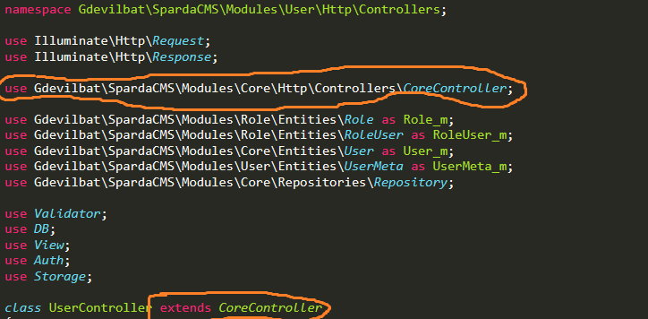
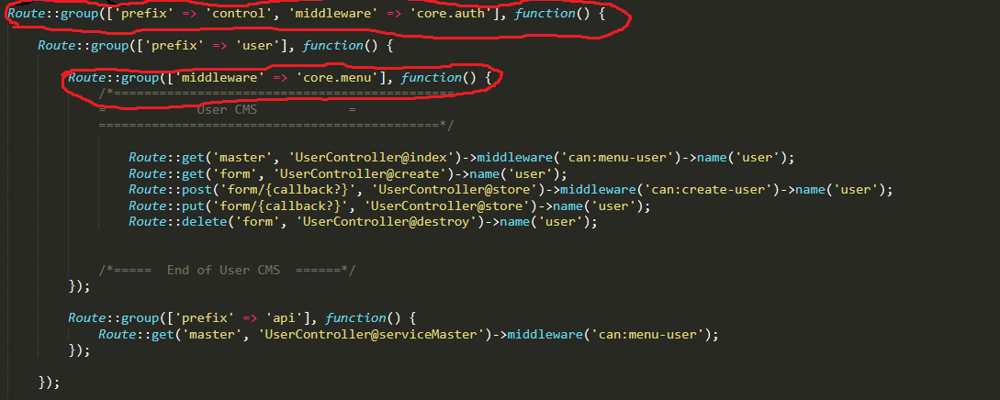
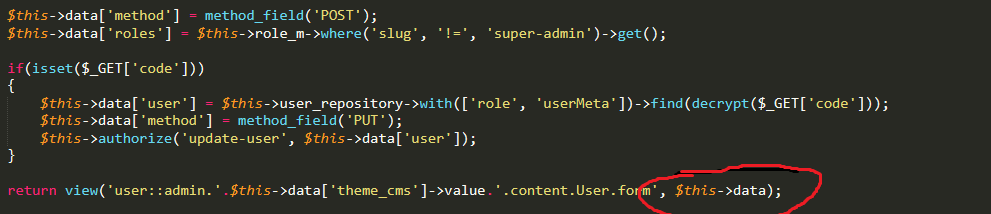
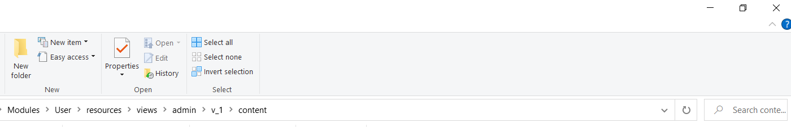
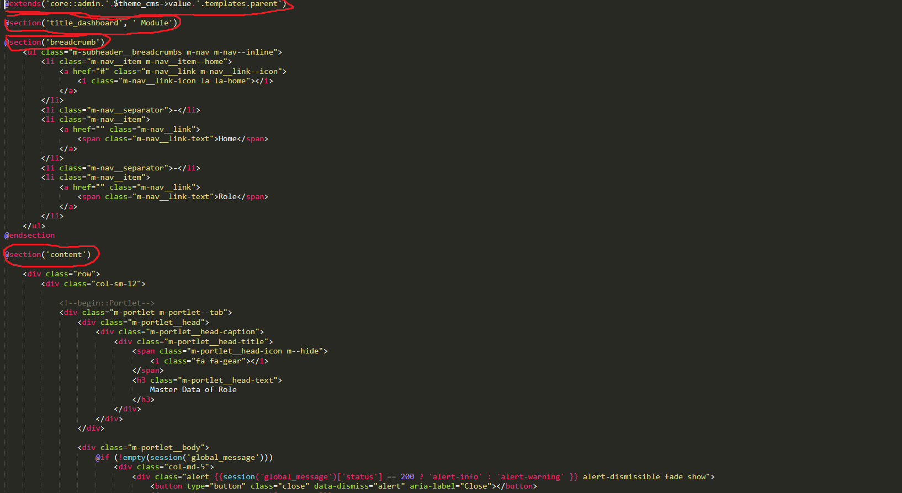
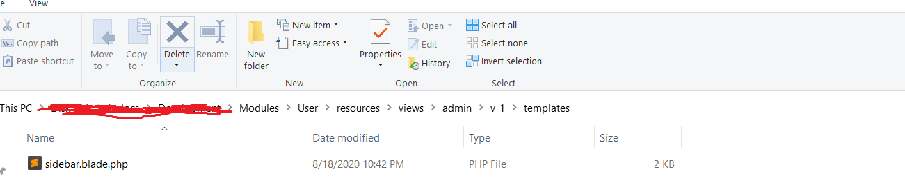
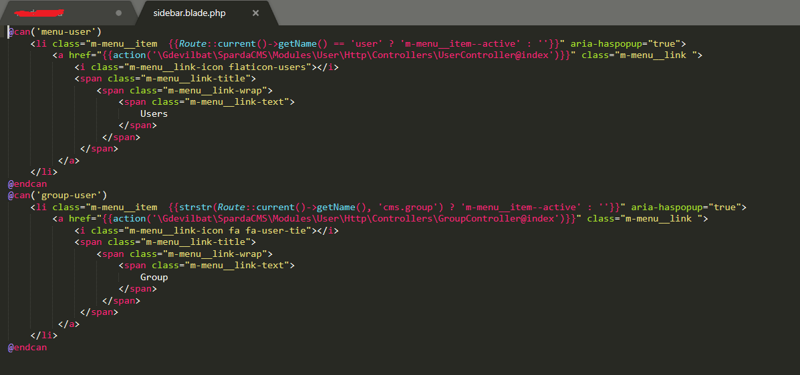
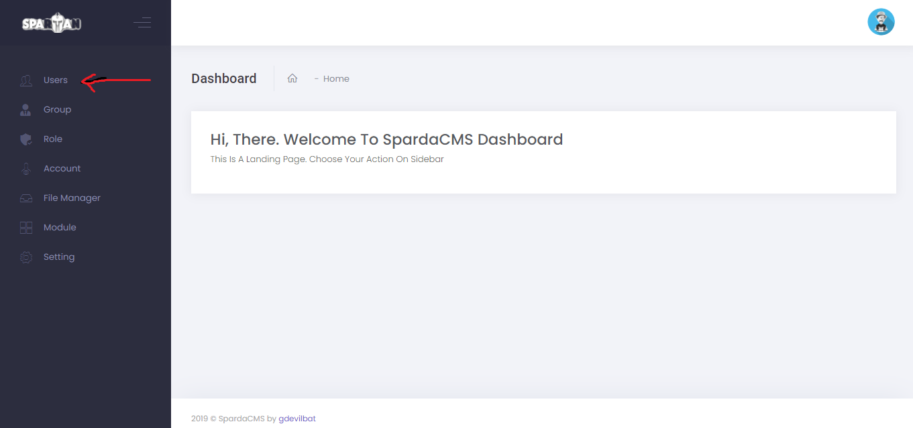

# SpardaCMS

> SpardaCMS is a Modular CMS for Buiding a Websites. You can add or make you own module base on your requirement. Some of built-in package will saving your time :)


## Features

- Account Profile
- User & Role
- Module Authorization
- Taxomies
- Page
- Post
- Ecommerce Integration (Tokopedia & Shoppee Syncronize Data)
- Datatable
- Filemanager

## Upcoming Features

- [ ] Membership
- [ ] Upload to Marketplace from Ecommerce Page

## Installation

#### > Clone this repo

```sh
composer create-project gdevilbat/spardacms {Aplication Name}
cd {Aplication Name}/
```

#### > Installing Packages

```sh
COMPOSER_MEMORY_LIMIT=-1 composer update -vv
```

#### > Installing and activating the virtual environment

```sh
cp .env .example
nano .env
```

- Set Database Name
- Set User & Pass for For Database

#### > Installing Factory Database and Seeder

```sh
php artisan migrate
php artisan module:sparda-seed
```

## Running on Local

```sh
http://localhost/{Aplication_Name}/control/auth
```

## Installing New Module

#### > Create Module

```sh
php artisan module:make {Module Name}
```

#### > Extend Controller From Gdevilbat Core Controller

- Open Controller Folder
- Open Controller File
- Use class Gdevilbat Core Controller



#### > Register Controller to Route

- Open web route file
- Use prefix control
- Use midleware core.auth and core.menu



#### > Parsing Variable into Blade

- use $this->data to blade view function



- open folder resources > views > admin > content
- make blade file and extend parent template
- Fill title_dashboard, breadcumm and content section
- You can add your own assets on page_level_css and page_level_js  section





#### > Register Sidebar Menu

- open folder resources > views > admin > content
- make sidebar.blade.php file





- You will have your Module menu On Sidebar



## Author

##### Muhammad Aldi Nur Ibrahim - [SpardaCMS](https://github.com/gdevilbat/SpardanCMS) ( Web Version - this repo)

> Distributed under the [GNU GPLv3](https://choosealicense.com/licenses/gpl-3.0/) license. See `LICENSE` for more information.
